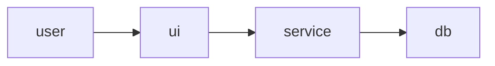

# Spec — {{FEATURE_TITLE}}

> **Status**: 📝 Draft &nbsp;·&nbsp; **Owner**: {{OWNER}} &nbsp;·&nbsp; **Last updated**: {{YYYY-MM-DD}}
> **Related**: [Issue/PR](#) · [Design](#) · [ADR](#)

---

## 1. Goal

> One paragraph in the **user's voice**. What problem this solves and what changes for the user when it ships.

{{GOAL}}

---

## 2. Background — why now

> What changed? What pain are users feeling? What data, request, or strategic move triggered this?

- {{BG_BULLET_1}}
- {{BG_BULLET_2}}

---

## 3. Scope

### In (v1)

- {{IN_1}}
- {{IN_2}}

### Out

- {{OUT_1}} — *Reason: …*
- {{OUT_2}} — *Reason: …*

### Future (v2 maybe)

- {{FUTURE_1}}

---

## 4. User stories / scenarios

> Numbered, in the user's voice. Cover the happy path and 1-2 important edge cases.

1. **As a** {{persona}}, **I want** {{action}}, **so that** {{outcome}}.
2. **As a** {{persona}}, **when** {{condition}}, **I see** {{result}} **so that** {{outcome}}.
3. ...

---

## 5. Success criteria

> Measurable. Each criterion includes how we'll verify it (analytics event, test, manual QA, business KPI).

| # | Criterion | How we verify |
|---|---|---|
| 1 | {{CRITERION_1}} | {{VERIFY_1}} |
| 2 | {{CRITERION_2}} | {{VERIFY_2}} |

---

## 6. Technical approach (high-level)

> No file paths yet. Describe the architecture and data flow at a level a senior reviewer can sign off on.

{{APPROACH_PROSE}}

---

## 7. Architecture / data model

> If applicable, one diagram or schema sketch. Mermaid preferred.



OR

```
table {{name}} {
  id        text pk
  user_id   text fk
  created_at int
}
```

---

## 8. Constraints

| Area | Constraint |
|---|---|
| Privacy | {{PRIVACY}} |
| Performance | {{PERF}} |
| Regulatory | {{REGULATORY}} |
| Platform | {{PLATFORM}} |
| Dependencies | {{DEPS}} |
| Tech stack alignment | Must follow project's `CLAUDE.md` + `/bymax-workflow:standards` |

---

## 9. Risks

| Risk | Score | Mitigation |
|---|---|---|
| {{RISK_1}} | 🔴 HIGH / 🟡 MEDIUM / 🟢 LOW | {{MITIGATION_1}} |
| {{RISK_2}} | … | … |

---

## 10. Open questions

> Things we don't know yet that could change the design. Each must be answered before phase planning starts (or marked "deferred to v2").

- [ ] {{QUESTION_1}}
- [ ] {{QUESTION_2}}

---

## 11. References

- Prior art / inspiration:
- Related issues:
- Design files:
- ADRs touched: `docs/decisions/{{ADR}}.md`

---

## Sign-off

When this spec is approved, run:

```
/bymax-workflow:roadmap docs/specs/{{feature-slug}}.md
```

to break it into a phased execution plan.
